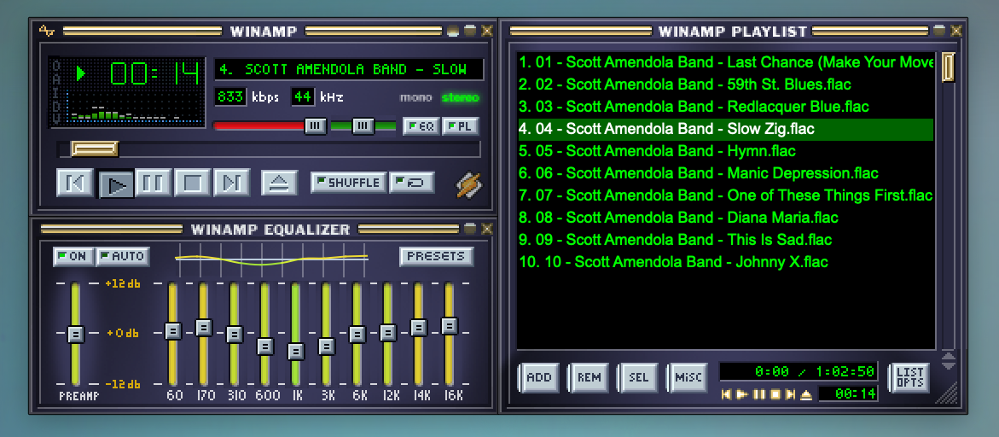
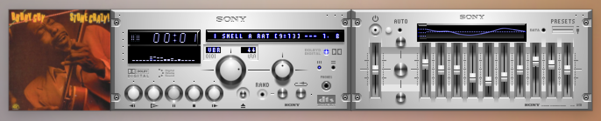

# WimPyAmp

## Overview

WimPyAmp is a desktop music player designed for playing your local music collection, including hi-res lossless files. It’s compatible with Winamp skins for a really fun retro-pixel UI, and it looks suprisingly great on modern desktops. There are [thousands](https://skins.webamp.org/) of custom skins available that (should) work with WimPyAmp. You can even make your own!

WimPyAmp assumes that you have your music collection and playlists reasonably organized on your file system or network share, so it doesn’t try to create some kind of library. It trusts you know how to find your own music.

## Using WimPyAmp

The app pretty much works like you might remember from Winamp (if you're old enough to remember). The “eject” button in the main window let’s you choose and load a single track. If you open the Playlist window, you’ll find options to load playlist files or add entire directories to the playlist (useful for albums).

Click the “V” button in the main window clutterbar to toggle between visualizer types (spectrum analyzer, waveform, none).

To load a new skin or reload the default skin, either choose the Settings menu, or click “O” in the main window clutter bar.

WimPyAmp also has support for Album Art. Click "I" in the main window clutter bar, and an Album Art window will appear. It should show art from either the current track's metadata or an image in the same directory like `folder.jpg`. If there isn’t any art available, you’ll see a placeholder image.

## Features and Bugs

Want other features? Found a bug? Open an Issue!

Q: Does WimPyAmp support streaming services like Spotify? Is that planned?
A: Nope

Q: Will it play CDs or SACDs?
A: You have a CD/DVD drive? Wow. I’ll keep it in mind.

Linux users may need to hold down the Super key (CMD/WIN) while using the mouse to move the app windows. Snapping and docking is not supported on Linux.

### Python

WimPyAmp works with Python3 on Mac, Linux, and Windows. Releases that bundle Python are currently available for Mac on Intel and Apple Silicon. Other platforms will (eventually) follow.

## Developer Notes

### Makefile

There's a Makefile in the project that should handle everything for Mac and Linux users. After cloning the repo, just run `make setup` to install dependencies and create the venv, then run `make run`.

Type `make help` to see other options, like linting or making an app bundle or binary.

Windows users can either install WSL to use the Makefile, or use Powershell scripts in the `winscripts/` directory and tools in Visual Studio Code. Don’t forget to install Python via the MS Store.

Intel Mac Python support is fading away, so pay attention to supported libraries if you are on an old Mac.

### Libraries and Specs

WimPyAmp is really just a framework for some excellent Python libraries, including librosa, mutagen, Pillow, and others, connected to a PySide6 UI that renders bitmaps from Winamp skin archives.

Specs for implemented features are in the `docs/` directory, along with some original Winamp skinning guidelines.

There is an `AGENTS.md` file to help coding agents, tested with Qwen and Gemini.
There is also an `AGENT-lite.md` file that attempts to provide low-capability agents with instructions to avoid doing dumb things. It kinda works, sometimes.

### Thanks

Special thanks to the amazing [Webamp](https://webamp.org/) project, which archived key documents for the Winamp skin specification and provided a reference implementation for the mini-visualizer.

And thanks to the thousands of people who created really cool Winamp skins 25 years ago.

## License

WimPyApp is open-source, licensed under the MIT license. I've included licenses for the various libraries in the `licenses/` directory.

*WimPyAmp is not associated with Winamp, Webamp, Nullsoft, or Justin Frankel in any way. No source code from Winamp was used or referenced in this project. All rights belong to their respective owners.*

Copyright (c) 2025, Mike Perry
